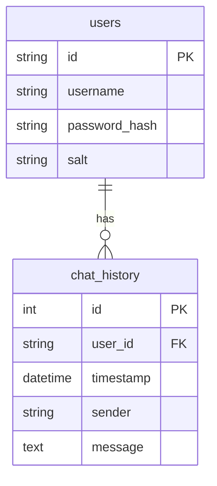

# **AI ChatBot Assistant with User Authentication** 🤖🔒  

A **Python-based desktop chatbot** powered by OpenAI GPT-3.5-turbo, featuring secure user authentication, persistent chat history, and text-to-speech responses. Built with `tkinter` for the GUI and `SQLite` for database storage.  


---

## **Features** ✨  
✅ **Secure Login/Signup** – Password hashing with SHA-512 + salt.  
✅ **Persistent Chat History** – All conversations saved in SQLite.  
✅ **OpenAI Integration** – Smart responses using GPT-3.5-turbo.  
✅ **Text-to-Speech** – Optional voice replies (`pyttsx3`).  
✅ **Clean UI** – Tkinter-based with modern `ttk` widgets.  
✅ **Clear Chat History** – Option to delete conversation history.  

---

## **Installation** ⚙️  

### **Prerequisites**  
- Python 3.8+  
- OpenAI API Key ([Get one here](https://platform.openai.com/))  

### **Steps**  
1. **Clone the repo**  
   ```sh
   git clone https://github.com/yourusername/ai-chatbot-assistant.git
   cd ai-chatbot-assistant
   ```

2. **Install dependencies**  
   ```sh
   pip install openai python-dotenv pyttsx3
   ```

3. **Set up environment variables**  
   - Create a `.env` file and add:  
     ```sh
     OPENAI_API_KEY=your_api_key_here
     ```

4. **Run the application**  
   ```sh
   python chatbot_app.py
   ```

---

## **Database Schema** 🗃️  


---

## **Usage** 🚀  
1. **Sign up** (First-time users) or **Log in**.  
2. **Chat with the AI** – Type messages and press `Enter`/`Send`.  
3. **Commands**:  
   - Type `bye`/`exit` to quit.  
   - Click **Clear History** to delete chat logs.  
   - Logout to switch users.  

---

## **Future Enhancements** 🔮  
- [ ] **Voice Input** (Speech recognition)  
- [ ] **Multi-Platform Support** (PyInstaller executable)  
- [ ] **Themes & Emojis** (Enhanced UI)  

---

## **Contributing** 🤝  
Feel free to open **issues** or **PRs**!  
1. Fork the repo.  
2. Create a branch (`git checkout -b feature/your-feature`).  
3. Commit changes (`git commit -m "Add feature"`).  
4. Push (`git push origin feature/your-feature`).  
5. Open a **Pull Request**.  

---

## **License** 📜  
MIT License – See [LICENSE](LICENSE).  

---


